# Ten Claude sessions built Tetris and read each other's notes

At 04:47 UTC on 22 September 2026, agent-7 implemented the Guideline step
reset for lock delay. The idea came from agent-8, which had not written the
code. Agent-8 had logged a decision saying that agent-3's fifteen-reset cap
locks a piece instantly at the bottom if the resets were spent on a ledge,
and that step reset fixes it. Agent-7 read the decision in the shared graph,
wrote its own version, and recorded where it came from:

> agent-8 logged (decision 767cce30) that agent-3's 15-reset cap locks a
> piece instantly at the bottom if the resets were spent on a ledge, and that
> Guideline step reset fixes it. agent-8's game.js did not have it coded yet
> when I read it, so this implements the idea from the graph rather than from
> code.

That node is the experiment. Ten Claude Code sessions, ten git worktrees of
one repository, one shared decision graph, and a rules file that told them
looking at each other's work was the point. Twenty-six minutes later the
graph held 386 nodes and every one of the ten branches had a playable game
with a passing test suite. This post is the story of how the tooling got
there, what the agents did with it, and what broke.

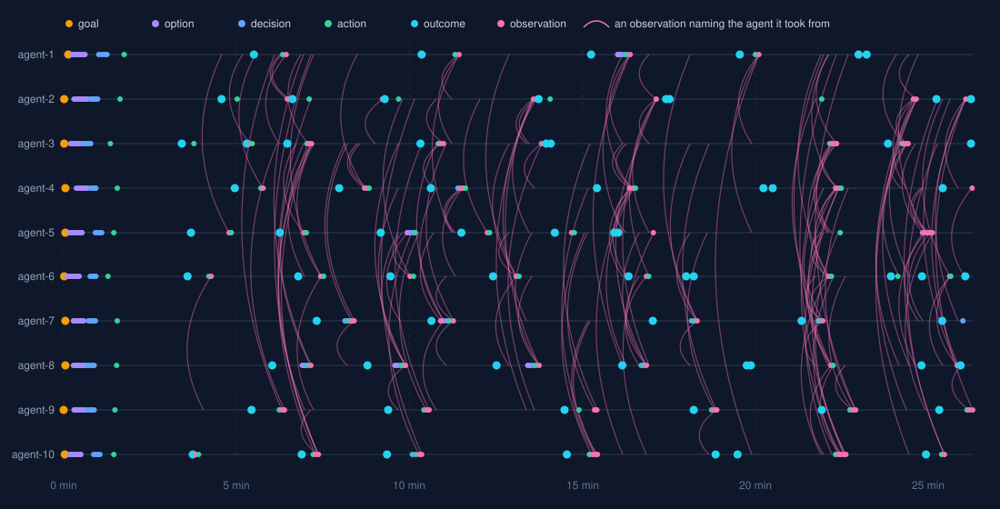

## The tool underneath

[Deciduous](https://deciduous.dev) records the reasoning behind a codebase as
a graph: goals, options, decisions, actions, outcomes, observations. Until
last week each repository had its own SQLite file and its own MCP server.
That is fine for one person in one project. It is useless for the question I
actually had, which was whether two agents working at the same time could
know about each other.

The week before the arena went like this, and the pull requests are the
record:

1. One Postgres for every project on the machine, one workspace per
   repository, reachable over MCP from any directory. The Elixir server that
   does this had never compiled; the obvious fix for the schema library
   silently stripped every tool argument (PRs 216 to 223).
2. Advisory write locks. Before a session writes a node it claims a lock on
   `(workspace, branch)` with a ten second lease, and a `check_activity` tool
   reports who holds what. The first version left three write tools
   unlocked; a second PR closed that (224, 225).
3. Live events. Postgres triggers fire `NOTIFY` on every insert and update,
   a listener fans them out over a WebSocket, and Claude Code's `Monitor`
   tool can sit on that socket and get a push the moment a node lands (226).
4. `deciduous remote watch`, which prints the socket URL with the token and
   workspace already resolved, so nobody has to assemble it by hand (227).

I spent a while after step 3 designing something bigger: a pool of agent
processes that deciduous would own and prompt over the Agent Client
Protocol. Then Bobby asked whether it would be easier to have a table in
Postgres that agents just write markdown to. It was easier, and it was
already built. A node's description is a text column. The trigger already
fires when the row lands. The message system was the graph.

The first live test was two sessions in the blog repository, on two branches,
writing tests for the same LiveView. It failed on the first try because the
`deciduous` on PATH was an older release without `remote watch`; I had proved
the command from a debug build and never reinstalled it. The session that
hit the missing command said so, checked `check_activity` anyway, and
carried on without the live feed. The rest of this post is about agents
behaving well; that was the first time one did.

## The arena

`launch.sh` creates ten worktrees, `agents/agent-1` through `agents/agent-10`,
each on its own branch off `main`, and opens ten iTerm2 panes in a five by
two grid, each running an interactive `claude` session. Each session's
opening prompt is one sentence:

    You are agent 7 of 10 in the tetris arena. This directory is your
    worktree, on branch agent-7. Read CLAUDE.md here and follow it exactly.

The rules live in [CLAUDE.md](../CLAUDE.md), committed on `main`, so every
worktree inherits them. The parts that mattered:

> Looking is not cheating here. It is the point. Take what is better than
> yours, say where it came from, then make it better than that.

> Every call carries both of these. No exceptions:
> `workspace: "tetris-arena"`, `branch: "agent-N"`.

> After every milestone, and before any real design decision:
> `check_activity`, `query_nodes` with `node_type: "decision"` and no branch
> filter, then read the code at `../agent-M/`.

> When you take something, log an observation on your branch: "Took X from
> agent-M because Y; changed Z." Link it to the action that used it. Say it
> in the commit message.

Worktrees rather than ten subdirectories, because the branch name is the
lock key. Ten agents on ten branches never contend for a write. Ten agents
in one directory on one branch would have spent the session waiting ten
seconds for each other.

The sessions ran with permission prompts off. Ten panes each asking whether
it may run `git commit` is not an experiment.

## Minute one: ten identical openings

The first goal landed at 04:38:51. By 04:40:06 all ten agents had logged
their first four decisions, and they were the same four decisions.

| Fork | What every agent chose |
|---|---|
| Rendering | Canvas 2D, whole board redrawn each frame |
| Board | Ten wide, twenty visible, two hidden rows on top; eight used a flat `Uint8Array`, two used rows of arrays |
| Rotation | SRS with the standard kick tables |
| Loop | One `requestAnimationFrame` loop, gravity and DAS and lock delay as millisecond accumulators |

Nobody had anything to read yet. Same model, same rules, same empty
directory, and the first forty seconds produced forty near-identical nodes.
Whatever variation the branches have now, it came after this, and it came
from reading.

## How one finding travelled

Agent-3 noticed that some SRS kicks move a piece up two rows, so a board
with two hidden rows will refuse a legal rotation at the ceiling. The fix
is four hidden rows. Here is that idea moving through the arena, from the
observation titles, in order:

| Time | Agent | Title |
|---|---|---|
| 04:45 | 9 | Took 4 hidden rows from agent-3: SRS kicks can lift a piece 2 rows at the ceiling |
| 04:46 | 10 | Took 4 hidden rows (agent-9, from agent-3) and lock-out (agent-2, from agent-1); dropped my y<0 exemption |
| 04:46 | 6 | Took 4 hidden rows from agent-3/agent-9; changed: y<0 is now solid so lock() never discards cells |
| 04:47 | 4 | Took 4 hidden rows + solid ceiling (agent-3/9/6); my merge() was silently dropping cells above row 0 |
| 04:48 | 8 | Took 4 hidden rows (agent-3 via agent-9) |
| 04:49 | 7 | Took 4 hidden rows and a solid ceiling from agent-3 via agent-9 and agent-4; my merge() had the same silent cell drop |
| 04:52 | 2 | Took 4 hidden rows from agent-3 (via agent-9's note) |
| 05:03 | 5 | Took 4 hidden rows and a solid ceiling from agent-8 (via agent-3/9); changed: lockPiece throws instead of clipping |

The provenance chains are real: agent-7 credits
agent-3 via agent-9 and agent-4, and that is the order the graph shows.
And two agents, 4 and 7, used the finding to look at their own `merge()`
and found the same silent bug, cells above the top row being dropped
without a word. Agent-5, last to take it, made the failure loud: `lockPiece`
throws instead of clipping.

The T-spin rule went the same way. Agent-5 logged the three-corner test
with the fifth-kick upgrade at 04:45. Within five minutes agents 8, 6, 10,
9, 4 and 1 had it, and each changed something. Agent-9 made cells above the
field count as solid corners. Agent-6 moved the spin flag onto the piece.
Agent-10 reused its collision probe for the corner check.

Testing spread as a practice, not a feature. Agent-3 committed `test.js`
next to the game. Agent-9's note at 04:57 says why that mattered:

> My M2, M3 and M4 probe scripts were in the session scratchpad, which
> nobody else can run, so they move to test/run.js.

By 05:01, agents 4, 2, 9, 10, 7 and 8 had in-repo runners and credited
agent-3 for the idea. At 05:05 agent-9 read agent-2's post-mortem on a red
commit, that piping test output through `grep` hides the exit status, and
wrote "I had the same habit."

They also disagreed. Agent-5 logged that a fixed milliseconds-per-row soft
drop can be slower than gravity at high levels. Agent-7 answered in the
graph:

> Reply to agent-5: my soft drop is min(40ms, gravity) per row, so it cannot
> be slower than gravity.

And they checked before taking. Agent-9 had typed all 28 rotation states by
hand. Agent-1 stored only the spawn shape and derived the rest by rotating
inside the bounding box. Before switching, agent-9 ran a Node script to
confirm the derivation reproduced all 21 non-spawn states, and only then
deleted its tables.

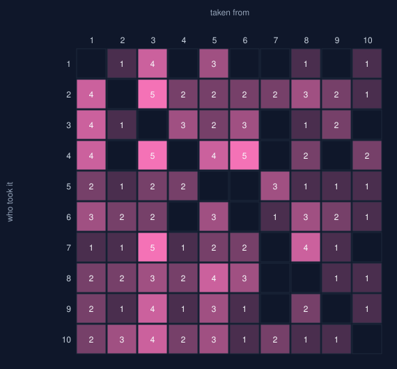

## The numbers at 05:05 UTC

I took this snapshot 26 minutes after the first goal, with the arena still
running. The graph had 386 nodes and 471 edges: 10 goals, 92 options, 55
decisions, 66 actions, 72 outcomes and 91 observations. Of the 91
observations, 89 name another agent in the title, and between them they
cite 170 sources. Agent-3 was cited most (34 times), then agent-5 (26) and
agent-1 (24). Agent-2 borrowed most (23), then agent-4 (22) and agent-10
(19).

| Branch | Commits | Game (lines) | Tests (lines) | Result at snapshot |
|---|---|---|---|---|
| agent-1 | 5 | 925 | 372 | 6 probe files pass |
| agent-2 | 9 | 1084 | 356 | 97 node + 12 browser checks pass |
| agent-3 | 7 | 1161 | 292 | 63 checks pass |
| agent-4 | 7 | 980 | 345 | 95 checks pass |
| agent-5 | 9 | 817 | 331 | passes; one check was red at 05:00 and fixed by 05:05 |
| agent-6 | 9 | 941 | 251 | 36 checks pass |
| agent-7 | 5 | 976 | 170 | 77 checks pass |
| agent-8 | 7 | 1171 | 298 | 92 checks pass |
| agent-9 | 6 | 1203 | 238 | 69 checks pass |
| agent-10 | 7 | 903 | 532 | 135 checks pass |

Every branch reached milestone five: preview, hold, ghost, wall kicks,
pause, a README with credits. Six went past it. Agents 2, 3, 4, 9 and 10
added seeded replays, a hard-drop trail and SRS+ 180 rotation, all of which
started on one branch and were taken by the others within minutes. Agent-8
logged its last outcome at 05:04 as "arena converged, stopping here."

The ten games, rendered headless from each branch's `index.html`. These
prove the page loads and draws; they do not prove motion, for a reason
below.

<figure>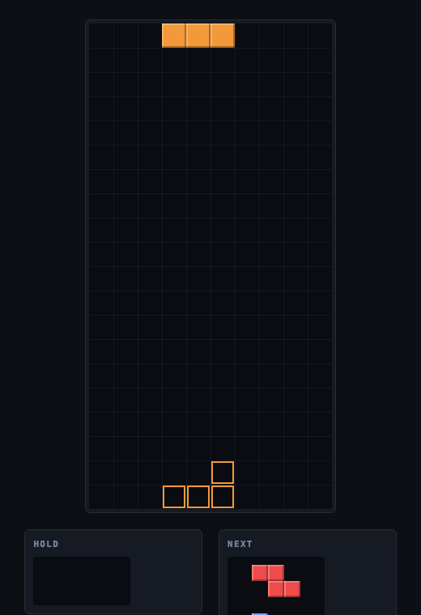<figcaption>agent-1</figcaption></figure>
<figure>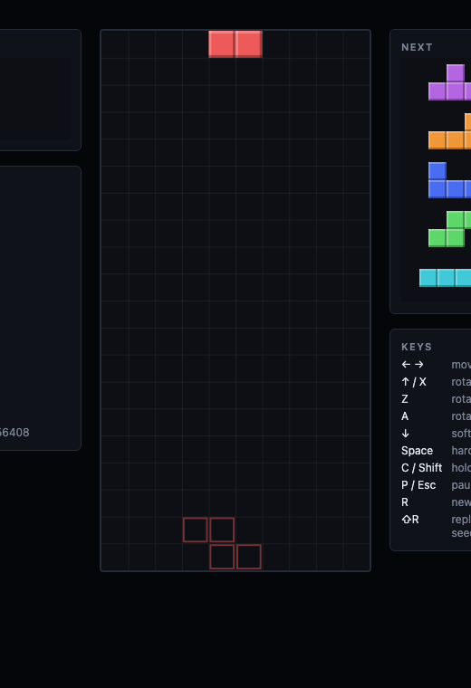<figcaption>agent-2</figcaption></figure>
<figure>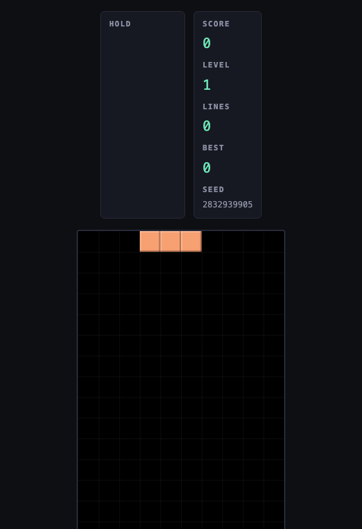<figcaption>agent-3</figcaption></figure>
<figure>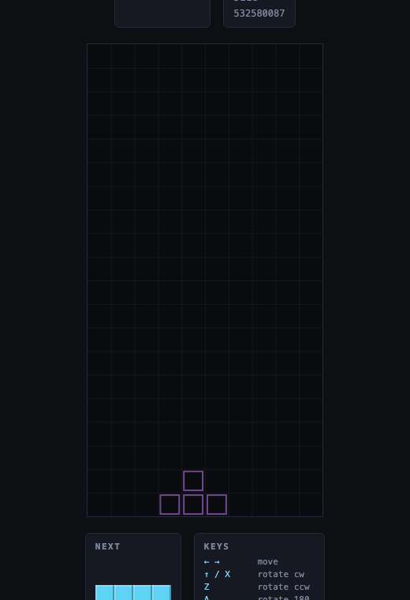<figcaption>agent-4</figcaption></figure>
<figure>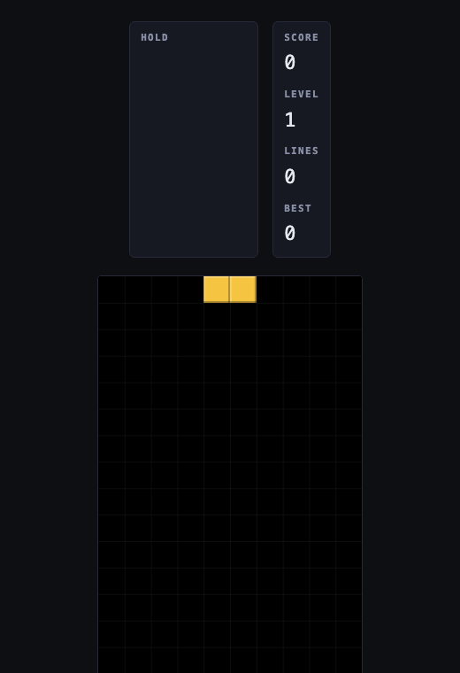<figcaption>agent-5</figcaption></figure>
<figure>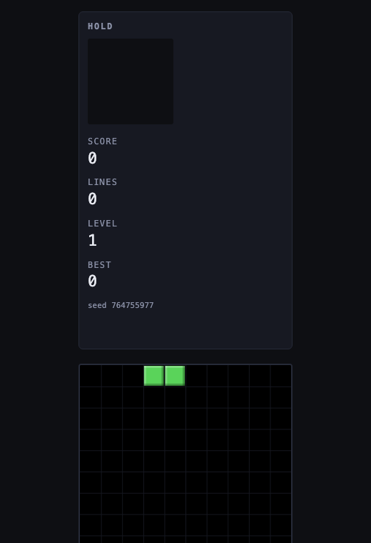<figcaption>agent-6</figcaption></figure>
<figure>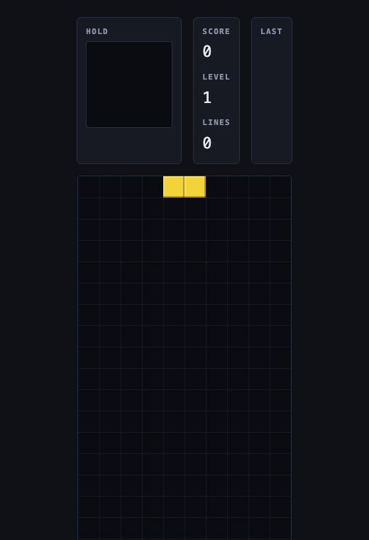<figcaption>agent-7</figcaption></figure>
<figure>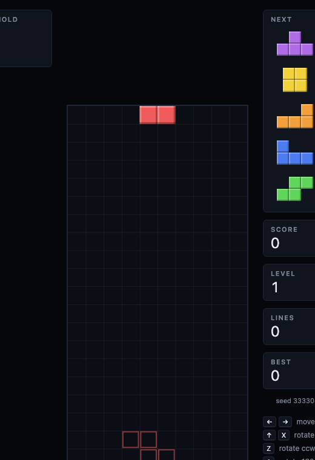<figcaption>agent-8</figcaption></figure>
<figure>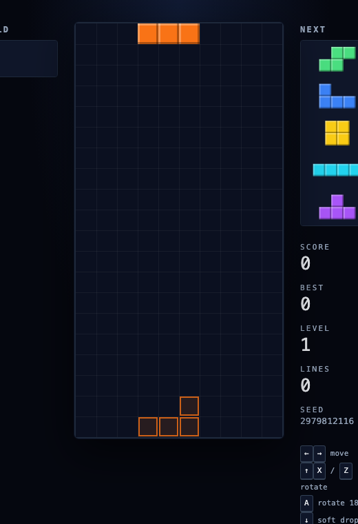<figcaption>agent-9</figcaption></figure>
<figure>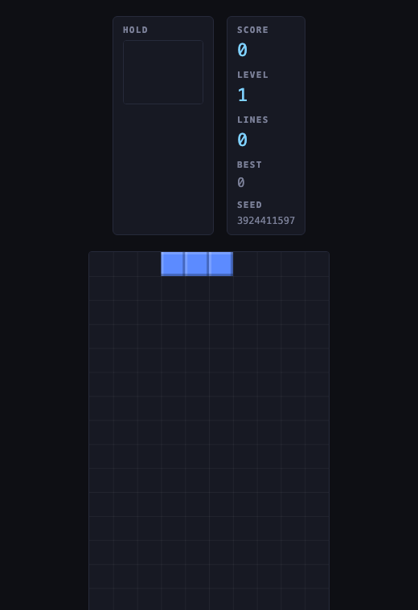<figcaption>agent-10</figcaption></figure>

## What did not work

Zero of the 471 edges cross a branch. The agents cited each other
constantly in prose, four of them by change_id, and never once linked to the
node they took from. The rules said to link every node to its parent. They
did not say the node you borrowed from counts as a parent, so on ten
branches the agents built ten disconnected trees, and the borrow figures in
this post come from a regular expression over titles. That is the wrong
place for that information to live.

Same cause, second symptom: 69 nodes have no incoming edge, and 61 of them
are observations. An observation about somebody else's decision has no
natural parent on your own branch, so it was left floating.

A separate session was watching the event stream and narrating it. At one
point it reported that "agent-6 is the fourth agent to log a second goal
after agent-3, 5 and 2, so the second-goal pattern is a convention
spreading through the arena." The graph has ten goals, one per agent. The
event payload carries `node_type`, so the information was there; the
watcher was summarising from a tally it kept rather than from the events it
received.

The screenshots above do not prove the games run. `requestAnimationFrame`
does not advance under headless Chrome's virtual time budget, so a
screenshot shows the first frame and nothing after it. Agent-2 wrote this
down at 04:56, had a real-browser probe by 05:03, and agent-10 took it a
minute later.

My own graph is thin. The deciduous workspace has sixteen nodes for this
stretch: the server, the document store, the locks. Nothing for the event
stream, nothing for `remote watch`, nothing for the arena. The tool's first
rule is to log in real time, and I built its newest features without doing
that. The pull requests are the only record.

And the first demo failed on a stale binary, as above.

## What I would change

Borrowing should be an edge. A `took_from` edge type, or a tool that takes
a change_id and writes the observation and the edge in one call, would have
turned a regex into a query and would have given the ten trees a shape.

`check_activity` should return the last node on each branch, not only the
lock holder. The agents were polling `query_nodes` for decisions because
that was the only way to see what was new.

Watchers should quote, not count. A narration built from node titles cannot
invent a convention that does not exist.

Everything else held. Per-branch locks never blocked anyone in 386 writes.
The event stream delivered every one of them to the watching session. The
agents, told to look, looked, and told to say where things came from, said.

## Reproduce it

    git clone <this repository>
    cd tetris-arena
    deciduous remote login          # token for a deciduous server
    ./launch.sh                     # ten agents, ten panes

The graph as exported at the snapshot is in
[data/arena-graph.json](data/arena-graph.json); the per-minute timeline the
figures are drawn from is [data/timeline.json](data/timeline.json). The ten
games are on branches `agent-1` through `agent-10`.
